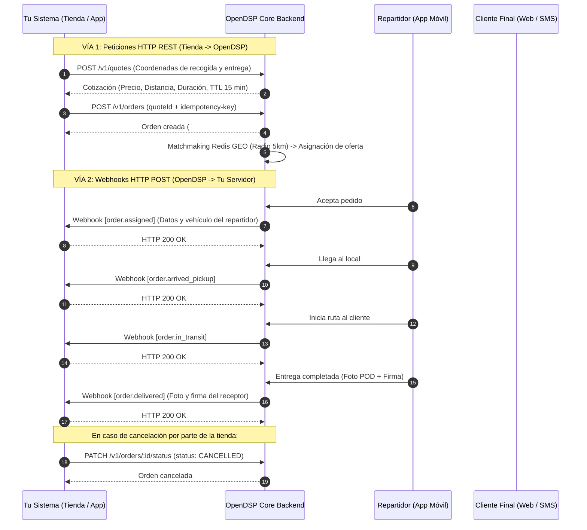

# 📘 Manual de Integración B2B — OpenDSP Engine
> **Guía técnica oficial para Comercios, Restaurantes, Tiendas E-commerce y Plataformas de Terceros.**

Bienvenido al manual de integración de **OpenDSP**. Este documento explica paso a paso cómo conectar tu sistema (e-commerce, ERP, POS o backend propio) a nuestra plataforma para cotizar envíos, solicitar repartidores en tiempo real, recibir actualizaciones de estado mediante Webhooks firmados criptográficamente y cancelar pedidos cuando sea necesario.

---

## 📑 Tabla de Contenidos
1. [Arquitectura General y Flujo de Comunicación](#1-arquitectura-general-y-flujo-de-comunicación)
2. [Paso 1: Onboarding y Obtención de Credenciales](#2-paso-1-onboarding-y-obtención-de-credenciales)
3. [Paso 2: Encabezados y Autenticación de Peticiones](#3-paso-2-encabezados-y-autenticación-de-peticiones)
4. [Paso 3: Endpoints de la API (De la Tienda a OpenDSP)](#4-paso-3-endpoints-de-la-api-de-la-tienda-a-opendsp)
   - [3.1 Cotizar Envío (`POST /v1/quotes`)](#31-cotizar-envío-post-v1quotes)
   - [3.2 Crear y Despachar Orden (`POST /v1/orders`)](#32-crear-y-despachar-orden-post-v1orders)
   - [3.3 Cancelar una Orden (`PATCH /v1/orders/:id/status`)](#33-cancelar-una-orden-patch-v1ordersidstatus)
   - [3.4 Consultar Detalle y Auditoría (`GET /v1/orders/:id`)](#34-consultar-detalle-y-auditoría-get-v1ordersid)
   - [3.5 Tracking Público para el Cliente Final (`GET /v1/orders/track/:token`)](#35-tracking-público-para-el-cliente-final-get-v1orderstracktoken)
5. [Paso 4: Webhooks en Tiempo Real (De OpenDSP a la Tienda)](#5-paso-4-webhooks-en-tiempo-real-de-opendsp-a-la-tienda)
   - [4.1 Formato del Payload y Encabezados](#41-formato-del-payload-y-encabezados)
   - [4.2 Catálogo de Eventos](#42-catálogo-de-eventos)
   - [4.3 Verificación de Firma HMAC SHA-256 (Node.js, Python, PHP)](#43-verificación-de-firma-hmac-sha-256)
   - [4.4 Reintentos y Manejo de Errores en Webhooks](#44-reintentos-y-manejo-de-errores-en-webhooks)
6. [Paso 5: Telemetría GPS en Vivo (WebSockets)](#6-paso-5-telemetría-gps-en-vivo-websockets)
7. [Códigos de Estado y Respuestas de Error](#7-códigos-de-estado-y-respuestas-de-error)

---

## 1. Arquitectura General y Flujo de Comunicación

El flujo de integración opera en **dos vías**:



---

## 2. Paso 1: Onboarding y Obtención de Credenciales

Para que un negocio opere con OpenDSP, debe registrarse a través del **Panel de Control de Administrador** (pestaña *"Tiendas y Claves API"*) o mediante el endpoint de administración `POST /v1/tenants`.

### Datos requeridos del comercio:
1. **Nombre de la Tienda:** Nombre comercial (ej: `SuperEats Bolivia`).
2. **Correo Electrónico:** Correo del equipo técnico o de operaciones.
3. **URL del Webhook (HTTPS):** Endpoint de tu servidor que recibirá las notificaciones de estado (ej: `https://api.tutienda.com/webhooks/dsp`).

### Credenciales entregadas al comercio:
* 🔑 **Clave API (`apiKeyRaw`):** Comienza con el prefijo `dsp_live_...` (ej: `dsp_live_8f91a2b3c4d5e6f7a8b9c0d1`). **Se muestra una sola vez al generarse**.
* 🛡️ **Secreto de Webhook (`webhookSecret`):** Comienza con el prefijo `whsec_...` (ej: `whsec_99418af882b7c43310fedcba`). Se utiliza para verificar criptográficamente que los Webhooks provienen de OpenDSP.

---

## 3. Paso 2: Encabezados y Autenticación de Peticiones

Cada solicitud HTTP enviada a OpenDSP debe incluir los siguientes encabezados:

| Encabezado | Tipo | Requerido | Descripción |
| :--- | :--- | :---: | :--- |
| `x-api-key` | String | **Sí** | Tu clave de API privada (`dsp_live_...`). |
| `idempotency-key` | UUID | Recomendado | Clave única generada por tu servidor (UUID v4) para evitar la duplicación accidental de órdenes ante reintentos de red. |
| `Content-Type` | String | **Sí** | Debe ser `application/json`. |

---

## 4. Paso 3: Endpoints de la API (De la Tienda a OpenDSP)

**URL Base de la API:** `http://localhost:3000/v1` *(o tu dominio en producción: `https://api.tudominiodsp.com/v1`)*

---

### 3.1 Cotizar Envío (`POST /v1/quotes`)
Calcula el costo del envío, la distancia ortodrómica y la duración estimada aplicando tarifas base y factores dinámicos (surge pricing). La cotización tiene una **vigencia garantizada de 15 minutos (TTL)**.

#### Petición cURL:
```bash
curl -X POST "http://localhost:3000/v1/quotes" \
  -H "x-api-key: dsp_live_8f91a2b3c4d5e6f7a8b9c0d1" \
  -H "Content-Type: application/json" \
  -d '{
    "pickupAddress": "Av. San Martín #450, Equipetrol",
    "pickupLat": -17.7833,
    "pickupLng": -63.1821,
    "dropoffAddress": "Calle Los Pinos #120, Barrio Sirari",
    "dropoffLat": -17.7950,
    "dropoffLng": -63.1700,
    "surgeMultiplier": 1.0
  }'
```

#### Respuesta Exitosa (`HTTP 201 Created`):
```json
{
  "id": "32df9e8e-d9f7-4148-8cf4-fcf629cbbe70",
  "tenantId": "7b2a9d1e-1234-4567-89ab-cdef01234567",
  "pickupAddress": "Av. San Martín #450, Equipetrol",
  "pickupLat": -17.7833,
  "pickupLng": -63.1821,
  "dropoffAddress": "Calle Los Pinos #120, Barrio Sirari",
  "dropoffLat": -17.7950,
  "dropoffLng": -63.1700,
  "distanceKm": 1.85,
  "durationMinutes": 10,
  "basePrice": 5.22,
  "surgeMultiplier": 1.0,
  "totalPrice": 5.22,
  "driverPayout": 4.18,
  "currency": "USD",
  "expiresAt": "2026-08-25T20:30:00.000Z",
  "createdAt": "2026-08-25T20:15:00.000Z"
}
```

---

### 3.2 Crear y Despachar Orden (`POST /v1/orders`)
Genera la orden de despacho, crea el registro de auditoría inmutable e inicia automáticamente el algoritmo de búsqueda por proximidad geográfica (matchmaking Redis GEO en radio de 5km).

#### Opción A: Crear Orden mediante `quoteId` (Recomendado)
```bash
curl -X POST "http://localhost:3000/v1/orders" \
  -H "x-api-key: dsp_live_8f91a2b3c4d5e6f7a8b9c0d1" \
  -H "idempotency-key: d7a16b1e-9920-4a2a-8c01-7faef83151cf" \
  -H "Content-Type: application/json" \
  -d '{
    "quoteId": "32df9e8e-d9f7-4148-8cf4-fcf629cbbe70",
    "merchantReference": "PEDIDO-TIENDA-9941",
    "packageNotes": "Entregar en portería del edificio. Tocar timbre 4B."
  }'
```

#### Opción B: Crear Orden Directa (Coordenadas Crudas)
```bash
curl -X POST "http://localhost:3000/v1/orders" \
  -H "x-api-key: dsp_live_8f91a2b3c4d5e6f7a8b9c0d1" \
  -H "idempotency-key: d7a16b1e-9920-4a2a-8c01-7faef83151cf" \
  -H "Content-Type: application/json" \
  -d '{
    "merchantReference": "PEDIDO-TIENDA-9942",
    "pickupAddress": "Av. San Martín #450, Equipetrol",
    "pickupLat": -17.7833,
    "pickupLng": -63.1821,
    "dropoffAddress": "Calle Los Pinos #120, Barrio Sirari",
    "dropoffLat": -17.7950,
    "dropoffLng": -63.1700,
    "packageNotes": "Pedido frágil (Sushi)."
  }'
```

#### Respuesta Exitosa (`HTTP 201 Created`):
```json
{
  "id": "ord_8f912a7b",
  "tenantId": "7b2a9d1e-1234-4567-89ab-cdef01234567",
  "quoteId": "32df9e8e-d9f7-4148-8cf4-fcf629cbbe70",
  "merchantReference": "PEDIDO-TIENDA-9941",
  "status": "CREATED",
  "pickupAddress": "Av. San Martín #450, Equipetrol",
  "pickupLat": -17.7833,
  "pickupLng": -63.1821,
  "dropoffAddress": "Calle Los Pinos #120, Barrio Sirari",
  "dropoffLat": -17.7950,
  "dropoffLng": -63.1700,
  "price": 5.22,
  "driverPayout": 4.18,
  "packageNotes": "Entregar en portería del edificio. Tocar timbre 4B.",
  "trackingToken": "track-434567-a8b9c0",
  "createdAt": "2026-08-25T20:16:00.000Z"
}
```

---

### 3.3 Cancelar una Orden (`PATCH /v1/orders/:id/status`)
Si el cliente final cancela su pedido en tu tienda, o la cocina no puede procesar el pedido, debes enviar una solicitud de cancelación para liberar al conductor o suspender la búsqueda.

#### Petición cURL:
```bash
curl -X PATCH "http://localhost:3000/v1/orders/ord_8f912a7b/status" \
  -H "x-api-key: dsp_live_8f91a2b3c4d5e6f7a8b9c0d1" \
  -H "Content-Type: application/json" \
  -d '{
    "status": "CANCELLED",
    "notes": "Cliente canceló el pedido por demora en cocina."
  }'
```

#### Respuesta Exitosa (`HTTP 200 OK`):
```json
{
  "id": "ord_8f912a7b",
  "status": "CANCELLED",
  "merchantReference": "PEDIDO-TIENDA-9941",
  "updatedAt": "2026-08-25T20:18:00.000Z"
}
```

---

### 3.4 Consultar Detalle y Auditoría (`GET /v1/orders/:id`)
Permite recuperar toda la información de un pedido, los datos del conductor asignado y la bitácora inmutable de auditoría con la cronología exacta de cambios de estado.

```bash
curl -X GET "http://localhost:3000/v1/orders/ord_8f912a7b" \
  -H "x-api-key: dsp_live_8f91a2b3c4d5e6f7a8b9c0d1"
```

---

### 3.5 Tracking Público para el Cliente Final (`GET /v1/orders/track/:token`)
Endpoint público (sin autenticación) que puedes embeber en tu sitio web o enviar por WhatsApp/SMS a tu cliente final:
```
URL: http://localhost:3000/v1/orders/track/track-434567-a8b9c0
```

---

## 5. Paso 4: Webhooks en Tiempo Real (De OpenDSP a la Tienda)

Cada vez que un repartidor interactúa con el pedido o el sistema cambia de fase, OpenDSP realiza una petición **HTTP POST** inmediata a tu `webhookUrl`.

### 4.1 Formato del Payload y Encabezados

#### Encabezados HTTP recibidos en tu servidor:
* `Content-Type: application/json`
* `x-dsp-signature: <firma_hexadecimal_hmac_sha256>`
* `x-dsp-timestamp: <timestamp_iso_8601>`

#### Estructura del Cuerpo (JSON):
```json
{
  "event": "order.assigned",
  "timestamp": "2026-08-25T20:16:20.000Z",
  "data": {
    "order_id": "ord_8f912a7b",
    "merchant_reference": "PEDIDO-TIENDA-9941",
    "status": "ASSIGNED",
    "driver": {
      "id": "c8716b1e-6240-4b2a-8c01-7faef83151cf",
      "name": "Alex Courier",
      "phone": "+59170000000",
      "vehicle_type": "MOTORCYCLE",
      "vehicle_plate": "1234-XYZ"
    },
    "pickup_address": "Av. San Martín #450, Equipetrol",
    "dropoff_address": "Calle Los Pinos #120, Barrio Sirari",
    "tracking_url": "https://dsp.tudominio.com/track/track-434567-a8b9c0"
  }
}
```

---

### 4.2 Catálogo de Eventos

| Evento | Descripción | Datos Clave en `data` |
| :--- | :--- | :--- |
| `order.created` | Orden creada en OpenDSP y en cola de despacho. | `order_id`, `merchant_reference`, `status` |
| `order.assigned` | Repartidor encontró y aceptó el pedido. | `order_id`, `driver` (nombre, teléfono, placa, moto) |
| `order.arrived_pickup` | Repartidor llegó al local / restaurante a recoger el paquete. | `order_id`, `driver` |
| `order.in_transit` | Repartidor retiró el paquete y va en camino al cliente. | `order_id`, `driver`, `tracking_url` |
| `order.delivered` | Pedido entregado al cliente con éxito. | `order_id`, `proof_photo_url`, `signatureSvg` |
| `order.cancelled` | Pedido cancelado por la tienda o por soporte. | `order_id`, `status` |

---

### 4.3 Verificación de Firma HMAC SHA-256

Para garantizar que nadie suplante a OpenDSP, **debes validar la firma criptográfica** enviada en la cabecera `x-dsp-signature` utilizando tu `webhookSecret`.

#### 🟢 Ejemplo en Node.js (Express)
```javascript
const express = require('express');
const crypto = require('crypto');

const app = express();
app.use(express.json());

const WEBHOOK_SECRET = 'whsec_99418af882b7c43310fedcba'; // Tu secreto configurado

function verifySignature(payload, signature, secret) {
  const computed = crypto
    .createHmac('sha256', secret)
    .update(typeof payload === 'string' ? payload : JSON.stringify(payload))
    .digest('hex');
  return crypto.timingSafeEqual(Buffer.from(signature), Buffer.from(computed));
}

app.post('/webhooks/dsp', (req, res) => {
  const signature = req.headers['x-dsp-signature'];

  if (!signature || !verifySignature(req.body, signature, WEBHOOK_SECRET)) {
    console.error('❌ Firma de Webhook inválida. Solicitud rechazada.');
    return res.status(401).json({ error: 'Firma inválida' });
  }

  const { event, data } = req.body;
  console.log(`✅ Evento recibido con éxito: ${event} para orden ${data.order_id}`);

  switch (event) {
    case 'order.assigned':
      console.log(`🏍️ Repartidor asignado: ${data.driver.name} (${data.driver.vehicle_plate})`);
      break;
    case 'order.delivered':
      console.log(`📦 ¡Orden entregada! Foto POD: ${data.proof_photo_url}`);
      break;
    case 'order.cancelled':
      console.log(`⚠️ Orden cancelada: ${data.order_id}`);
      break;
  }

  // Responder 200 OK inmediatamente
  return res.status(200).json({ received: true });
});

app.listen(8080, () => console.log('Servidor de Webhooks escuchando en puerto 8080'));
```

#### 🐍 Ejemplo en Python (FastAPI)
```python
import hmac
import hashlib
import json
from fastapi import FastAPI, Header, HTTPException, Request

app = FastAPI()
WEBHOOK_SECRET = "whsec_99418af882b7c43310fedcba"

@app.post("/webhooks/dsp")
async def receive_dsp_webhook(request: Request, x_dsp_signature: str = Header(None)):
    raw_body = await request.body()
    
    computed_signature = hmac.new(
        WEBHOOK_SECRET.encode('utf-8'),
        raw_body,
        hashlib.sha256
    ).hexdigest()

    if not x_dsp_signature or not hmac.compare_digest(x_dsp_signature, computed_signature):
        raise HTTPException(status_code=401, detail="Firma de Webhook inválida")

    payload = json.loads(raw_body)
    event = payload.get("event")
    data = payload.get("data")

    print(f"✅ Evento verificado: {event} para orden {data.get('order_id')}")
    return {"received": True}
```

#### 🐘 Ejemplo en PHP
```php
<?php
$secret = 'whsec_99418af882b7c43310fedcba';
$payload = file_get_contents('php://input');
$signature = $_SERVER['HTTP_X_DSP_SIGNATURE'] ?? '';

$computedSignature = hash_hmac('sha256', $payload, $secret);

if (!hash_equals($computedSignature, $signature)) {
    http_response_code(401);
    echo json_encode(["error" => "Firma inválida"]);
    exit;
}

$data = json_decode($payload, true);
http_response_code(200);
echo json_encode(["received" => true]);
?>
```

---

### 4.4 Reintentos y Manejo de Errores en Webhooks
* **Tiempo límite de respuesta (Timeout):** Tu servidor debe responder con un código HTTP `2xx` en menos de **5 segundos**.
* **Política de Reintentos:** Si tu servidor responde con un error (`500`, `502`, `503`, `504`) o la conexión expira, el motor BullMQ de OpenDSP reintentará automáticamente con una estrategia de **backoff exponencial** (1 min, 5 min, 15 min, 1 hora).
* **Dead-Letter Queue (DLQ):** Tras 4 intentos fallidos, el evento se archiva en la DLQ y puede ser re-despachado manualmente desde el Panel de Administración.

---

## 6. Paso 5: Telemetría GPS en Vivo (WebSockets)

Si deseas mostrar en la pantalla de tu cliente o en tu dashboard interno el icono de la motocicleta moviéndose en tiempo real sobre el mapa:

1. Conectarse al WebSocket Gateway: `ws://localhost:3000/tracking` (o `wss://api.tudominiodsp.com/tracking`).
2. Emitir evento de suscripción a la sala de la orden:
   ```javascript
   socket.emit('order:subscribe', { orderId: 'ord_8f912a7b' });
   ```
3. Escuchar actualizaciones de ubicación en tiempo real emitidas cada 5 segundos:
   ```javascript
   socket.on('order:location_update', (data) => {
     console.log('Posición del Repartidor:', data.lat, data.lng, 'Velocidad:', data.speed, 'km/h');
   });
   ```

---

## 7. Códigos de Estado y Respuestas de Error

OpenDSP utiliza códigos de respuesta HTTP estándar con un formato JSON homogéneo:

```json
{
  "statusCode": 400,
  "exito": false,
  "mensaje": "La cotización ha expirado (vigencia de 15 min). Por favor genere una nueva cotización.",
  "ruta": "/v1/orders",
  "timestamp": "2026-08-25T20:25:00.000Z"
}
```

### Tabla de Códigos Frecuentes:
| Código HTTP | Significado | Causa Habitual |
| :--- | :--- | :--- |
| `200 OK` | Operación exitosa | Consulta, actualización o cancelación procesada. |
| `201 Created` | Recurso creado | Cotización u orden creada con éxito. |
| `400 Bad Request` | Parámetros inválidos | Coordenadas fuera de rango (-90 a 90), distancia > 50km o cotización expirada. |
| `401 Unauthorized` | Autenticación fallida | Clave `x-api-key` ausente o no reconocida. |
| `404 Not Found` | No encontrado | El `id` de orden o cotización no existe. |
| `409 Conflict` | Conflicto de estado | La orden ya fue tomada o no se encuentra en un estado cancelable. |
| `500 Internal Error` | Error de servidor | Excepción no controlada (contactar a soporte). |

---

## 🚀 Resumen Rápido para Desarrolladores

```text
1. Obtén tu Clave API (dsp_live_...) y Secreto Webhook (whsec_...) en el Admin Portal.
2. Cotiza con POST /v1/quotes (recibe precio y distancia estimada).
3. Crea el pedido con POST /v1/orders (usando quoteId y tu encabezado idempotency-key).
4. Recibe eventos en tu webhookUrl (order.assigned -> order.in_transit -> order.delivered).
5. Valida la firma HMAC en x-dsp-signature antes de procesar el evento.
6. Si necesitas cancelar el pedido, envía PATCH /v1/orders/:id/status con status: "CANCELLED".
```
